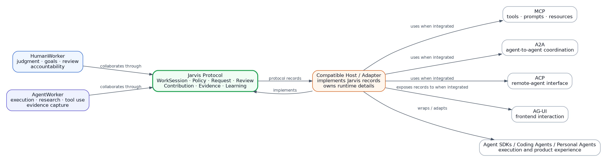
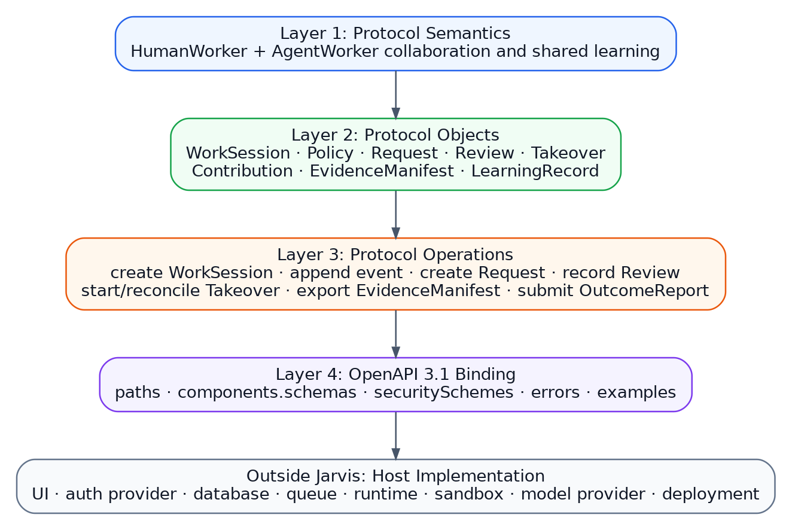
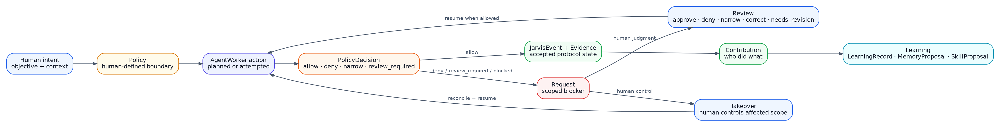
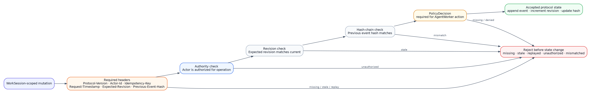
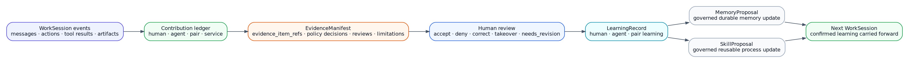
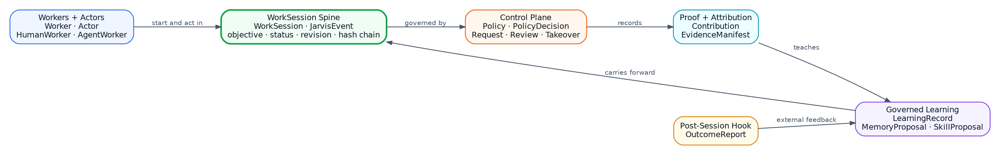
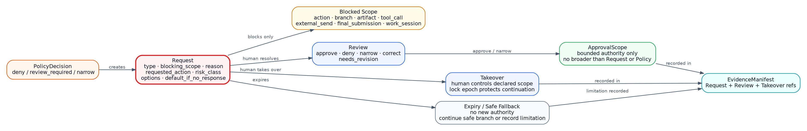
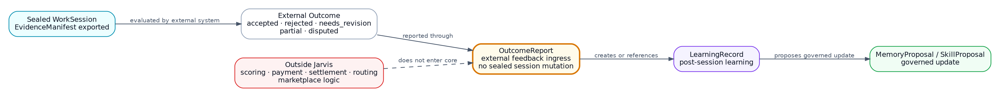
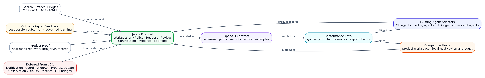

<section class="cover">

# Jarvis Protocol Architecture Brief

<div class="line"></div>

<p class="subtitle">Human-agent collaboration and learning-loop protocol</p>

Jarvis defines the protocol records that make human-agent work governed,
reviewable, attributable, evidence-backed, portable, and able to improve across
WorkSessions.

Jarvis is not a product, runtime, backend service, SDK, tool protocol, frontend
protocol, database, sandbox, or cloud stack.

<p class="meta">Scope: v0.1 first 30 days, with future adapter and ecosystem context.</p>

</section>

<div class="page-break"></div>

## Executive Summary

Jarvis is the protocol for governed human-agent collaboration and shared
learning. It defines how a HumanWorker and an AgentWorker coordinate inside a
WorkSession under shared goals and human-defined Policy, create Requests when
the AgentWorker is blocked, record Reviews and Takeovers from human judgment,
preserve attributable Contributions, export portable EvidenceManifest records,
and carry governed LearningRecords, MemoryProposals, and SkillProposals into
future WorkSessions.

The architecture is protocol architecture. It describes stable records,
operations, boundaries, and conformance expectations. It does not describe a
deployment architecture.

<div class="callout">
v0.1 proves the protocol contract, examples, conformance entry, and
existing-agent adoption boundary. Product proof and deeper adapter work wait
behind that protocol contract.
</div>

## Architecture Principles

| Principle | Meaning |
| --- | --- |
| Protocol-only | Jarvis defines portable collaboration records. Hosts own execution. |
| Human-agent team | The valuable unit is the HumanWorker and AgentWorker working together. |
| Policy-governed autonomy | AgentWorker action becomes protocol state only after PolicyDecision. |
| Human judgment central | Requests, Reviews, and Takeovers preserve human authority. |
| Evidence during work | EvidenceManifest references work evidence captured during the WorkSession. |
| Attributable contribution | Human, agent, pair, and service contributions remain distinguishable. |
| Governed learning | LearningRecords, MemoryProposals, and SkillProposals do not silently mutate durable state. |
| Runtime agnostic | Existing agents, SDKs, products, tools, and hosts remain first-class. |

### Research Grounding

Co-Gym reinforces the Jarvis thesis: human-agent collaboration needs dual
control, bidirectional communication, and non-turn-taking coordination. It also
shows why v0.1 must be strict about Requests and situational awareness without
turning every coordination idea into a core object.

Jarvis applies that lesson directly:

```txt
v0.1 defines the spine.
Future versions expand the coordination layer.
```

The v0.1 spine prevents wrong implementation of policy, Request, Review,
Takeover, Contribution, Evidence, and Learning. Notification protocols,
collaboration metrics, observation visibility, and richer coordination acts are
future extensions.

<div class="page-break"></div>

## C1: Protocol Ecosystem Context

The context view shows Jarvis as the protocol record between HumanWorkers,
AgentWorkers, hosts, existing agents, and adjacent protocols.

<div class="diagram">
  
</div>

### What This Means

- HumanWorkers and AgentWorkers collaborate through WorkSessions.
- Hosts and adapters implement Jarvis records.
- Existing agents remain first-class; Jarvis records collaboration around them.
- MCP, A2A, ACP, and AG-UI remain external protocols.
- Jarvis does not own frontend rendering, agent runtime, remote-agent execution,
  tool protocol semantics, database, auth provider, sandbox, or deployment.

<div class="page-break"></div>

## C2: Protocol Layer View

Jarvis separates protocol semantics, protocol objects, protocol operations, and
OpenAPI communication binding. Host implementation stays outside Jarvis.

<div class="diagram">
  
</div>

### Layer Responsibilities

| Layer | Responsibility |
| --- | --- |
| Protocol semantics | HumanWorker and AgentWorker collaboration and shared learning. |
| Protocol objects | WorkSession, Policy, Request, Review, Takeover, Contribution, EvidenceManifest, LearningRecord, MemoryProposal, SkillProposal, and related records. |
| Protocol operations | Create WorkSession, append event, create Request, record Review, start Takeover, record Contribution, export EvidenceManifest, submit OutcomeReport. |
| OpenAPI binding | HTTP paths, schemas, security schemes, errors, examples, and conformance entry. |
| Host implementation | UI, auth provider, database, queue, runtime, sandbox, model provider, deployment, and product workflow. |

<div class="page-break"></div>

<section class="landscape">

## WorkSession Control Flow

The control flow shows how agent autonomy, policy, human judgment, evidence,
and learning connect inside one WorkSession.

<div class="diagram wide">
  
</div>

</section>

### Control Flow Invariants

- WorkSession is the source of truth.
- AgentWorker action that affects a WorkSession records PolicyDecision before
  acceptance as protocol state.
- Action inside Policy records JarvisEvent and evidence.
- Action outside Policy creates a scoped Request.
- Request is not chat, notification, or authority.
- Human resolution requires Review or Takeover.
- Review decisions are approve, deny, narrow, correct, takeover, and
  needs_revision.
- Takeover creates a lock epoch and rejects stale autonomous continuation.

<div class="page-break"></div>

## Zero-Trust Mutation Gate

Jarvis starts from zero trust. Compatible implementations reject unsafe
mutations before protocol state changes.

<div class="diagram flow">
  
</div>

### Required WorkSession-Scoped Mutation Headers

```txt
Jarvis-Protocol-Version
Jarvis-Actor-Id
Jarvis-Idempotency-Key
Jarvis-Request-Timestamp
Jarvis-Expected-WorkSession-Revision
Jarvis-Previous-Event-Hash
```

Non-WorkSession protocol mutations use the non-WorkSession mutation header set:

```txt
Jarvis-Protocol-Version
Jarvis-Actor-Id
Jarvis-Idempotency-Key
Jarvis-Request-Timestamp
```

Worker registration, Actor registration, and OutcomeReport submission do not
require fake WorkSession revision or previous event hash values.

<div class="page-break"></div>

## Evidence And Learning Flow

Evidence and learning are not afterthoughts. They are part of the collaboration
record.

<div class="diagram">
  
</div>

### Evidence And Learning Invariants

- Contribution records who did what.
- EvidenceManifest references events, policy decisions, requests, reviews,
  takeovers, contributions, artifacts, evidence items, and limitations.
- Evidence is captured during work.
- LearningRecord captures what the human, agent, or pair learned.
- MemoryProposal and SkillProposal require governed review state.
- Unreviewed model or tool output cannot silently become durable memory or
  active skill.

<div class="page-break"></div>

## Adjacent Protocol Boundary

Jarvis integrates with adjacent protocols without replacing them.

| Adjacent system | What it owns | What Jarvis records |
| --- | --- | --- |
| MCP | Tools, prompts, resources, and context servers. | Tool/resource use as PolicyDecisions, JarvisEvents, Contributions, and Evidence. |
| A2A | Agent-to-agent communication and delegation. | Delegation evidence, participating AgentWorker refs, Contributions, and outcomes. |
| AGNTCY ACP | Remote-agent interface and OpenAPI-based agent access. | Collaboration record around remote-agent participation. |
| AG-UI | Agent-to-frontend event interaction and UI state. | WorkSession records that a host exposes to a frontend when frontend integration exists. |
| Agent SDKs | Model calls, tool calls, tracing, handoffs, runtime behavior. | Policy, review, contribution, evidence, and learning around execution. |
| Coding agents | Terminal/editor/repo execution workflows. | WorkSession evidence, human reviews, takeovers, and learning. |
| Personal agents | Product or assistant experience for a person. | Protocol semantics for governed human-agent collaboration. |

<div class="boundary">
Jarvis adoption fails if it requires a developer to abandon their existing
agent, runtime, SDK, product UI, model provider, sandbox, database, or cloud.
Jarvis adoption succeeds when different hosts produce the same protocol
semantics.
</div>

<div class="page-break"></div>

## v0.1 First 30 Days

The first 30 days produce a usable protocol contract.

| Area | v0.1 Work |
| --- | --- |
| `components.schemas` | Encode Worker, Actor, HumanWorker, AgentWorker, WorkSession, JarvisEvent, Policy, PolicyDecision, Request, Review, Takeover, Contribution, EvidenceManifest, LearningRecord, MemoryProposal, SkillProposal, and OutcomeReport. |
| `paths` | Encode create WorkSession, append event, record PolicyDecision, create Request, record Review, start/reconcile Takeover, record Contribution, create learning records, export EvidenceManifest, and submit OutcomeReport. |
| `securitySchemes` | Encode HostAuth, ActorHeader, ProtocolVersionHeader, IdempotencyHeader, RequestTimestampHeader, RevisionHeader, and PreviousHashHeader. |
| Errors | Encode protocol error ids and required error envelope. |
| Examples | Provide first examples for WorkSession, Request, Review, and EvidenceManifest export. |
| Conformance | Define golden-path and failure-mode checklists that reject fake implementations. |

v0.1 encodes the locked protocol. It does not redesign the thesis, object
model, lifecycle, control plane, evidence model, learning model, security
entry, or positioning boundary.

### v0.1 Spine

v0.1 includes the minimum protocol objects required to prove the collaboration
loop:

<div class="diagram">
  
</div>

```txt
Worker
Actor
HumanWorker
AgentWorker
WorkSession
JarvisEvent
Policy
PolicyDecision
Request
Review
Takeover
Contribution
EvidenceManifest
LearningRecord
MemoryProposal
SkillProposal
OutcomeReport
```

v0.1 includes the core protocol operations:

```txt
create WorkSession
append event
record PolicyDecision
create Request
record Review
start/reconcile Takeover
record Contribution
create LearningRecord
export EvidenceManifest
submit OutcomeReport
```

### Request Correctness

Request is the v0.1 control-plane object that prevents fake collaboration.

<div class="diagram">
  
</div>

The Request schema must preserve:

```txt
type
blocking_scope
reason
requested_action
risk_class
policy_decision_id
options
recommended_option
default_if_no_response
expires_at
resolution_ref
```

Request conformance must prove:

```txt
Policy-denied action creates Request.
AgentWorker cannot execute blocked action before resolution.
Request cannot resolve without Review or Takeover.
Narrowed approval prevents execution outside approved scope.
Takeover rejects stale AgentWorker continuation.
Expired Request follows safe fallback.
Request appears in EvidenceManifest.
```

### OutcomeReport Hook

OutcomeReport is the v0.1 external feedback ingress. It carries post-session
outcome information into governed learning without turning Jarvis into
Workstream, evaluation, payment, settlement, routing, or marketplace logic.

<div class="diagram">
  
</div>

Minimal example:

```txt
External task reviewer rejects submission
  -> OutcomeReport submitted
  -> LearningRecord created
  -> MemoryProposal or SkillProposal proposed
```

### Protocol Error Entry

The OpenAPI error model must include the protocol errors that protect the v0.1
spine. These include:

```txt
missing_policy_decision
request_unresolved
missing_review_resolution
missing_takeover_resolution
invalid_approval_scope
stale_takeover_epoch
invalid_previous_event_hash
duplicate_idempotency_key_mismatch
unauthorized_actor
missing_evidence_event_refs
silent_memory_mutation
silent_skill_activation
outcome_report_without_learning_record
```

<div class="page-break"></div>

## Future Adapter And Ecosystem Direction

Future work expands around the protocol without moving execution ownership into
Jarvis.

<div class="diagram">
  
</div>

| Future area | Direction | Boundary |
| --- | --- | --- |
| Existing-agent adapters | Map CLI agents, coding agents, SDK agents, and personal agents into Jarvis records. | Adapters preserve the existing agent runtime. |
| Host conformance | Provide golden-path and failure-mode fixtures that prove protocol behavior. | Conformance checks behavior, not infrastructure. |
| Product proof | Map a real product workspace into Jarvis WorkSessions and EvidenceManifest exports. | The product remains the host; Jarvis remains the protocol. |
| External protocol bridges | Record MCP, A2A, ACP, and AG-UI participation as Jarvis evidence and contribution records. | Jarvis does not redefine those protocols. |
| Evaluation feedback | Use OutcomeReport to carry post-session outcomes into governed LearningRecords. | Jarvis does not own task routing, scoring, payment, settlement, or marketplace logic. |
| Public adoption package | Publish OpenAPI contract, examples, conformance checklist, and protocol architecture brief. | Adoption does not require a Jarvis-owned runtime. |

### Deferred From v0.1

The following ideas are important but stay outside the v0.1 core:

```txt
Notification object
CoordinationAct object
ProgressUpdate
Observation visibility model
CollaborationMetrics
InitiativeBalance
TeachingSignal
HumanGrowthRecord
SimulatedHumanWorker
full existing-agent adapters
full Workstream feedback loop
real Garden product proof
MCP/A2A/ACP/AG-UI bridges
multi-agent reviewer protocol
```

These remain future extensions, examples, adapters, or conformance fixtures.
They do not enter the v0.1 object spine.

## Scope Boundary

Jarvis does not own:

- product UI
- authentication provider
- authorization backend
- database
- queues
- model provider
- tool execution
- sandbox implementation
- local execution
- cloud provider
- deployment
- billing
- product-specific workflow
- Garden POC
- Workstream evaluation logic
- Harnessy capability preparation

Jarvis owns the protocol records that hosts, adapters, products, and existing
agents implement.

## References

- Collaborative Gym: https://arxiv.org/abs/2412.15701
- MCP specification: https://modelcontextprotocol.io/specification/
- A2A specification: https://a2a-protocol.org/latest/specification/
- AGNTCY ACP specification: https://spec.acp.agntcy.org/
- AG-UI documentation: https://docs.ag-ui.com/
- OpenAPI 3.1.1: https://spec.openapis.org/oas/v3.1.1.html

## Closing

Jarvis v0 succeeds when a compatible implementation runs a HumanWorker and
AgentWorker through a WorkSession, proves policy-governed autonomy, captures
human judgment, records contribution, exports evidence, and carries governed
learning into the next WorkSession without adopting a Jarvis-owned runtime.
